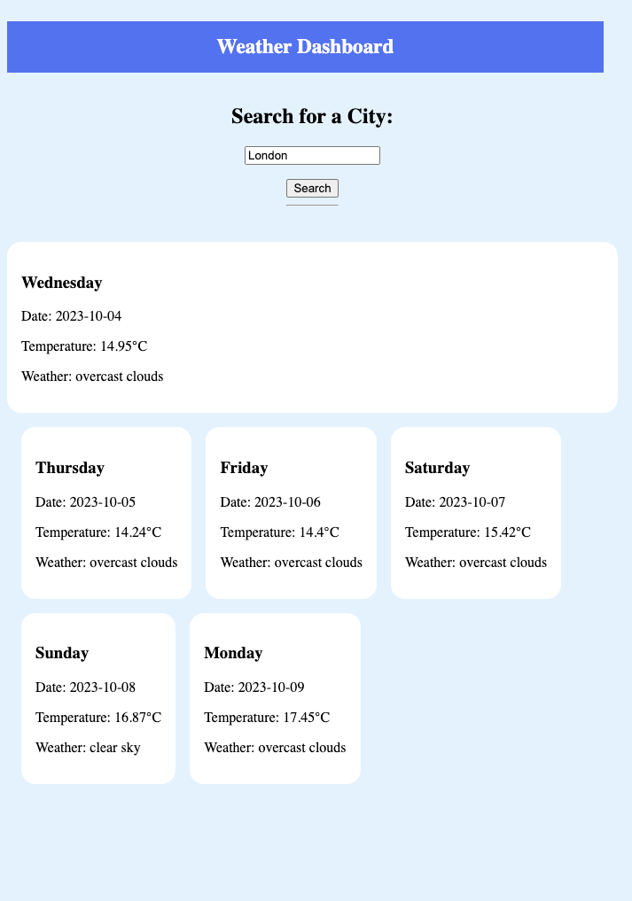

# Weather Dashboard

Generate openweather API key
Design weather app using HTML, CSS

## User Story

User can search by city name and it will show 5 days weather.

Usear able to see current location or any specific city.
Presented

- The city name
- The Date
- An icon representation of weather conditions
- The Temperature
- The humidity
- The wind speed

## Screenshots

## Deployed Link

https://syeduix.github.io/weather-dashboard/

## Link to GitHub

https://github.com/Syeduix/weather-dashboard
